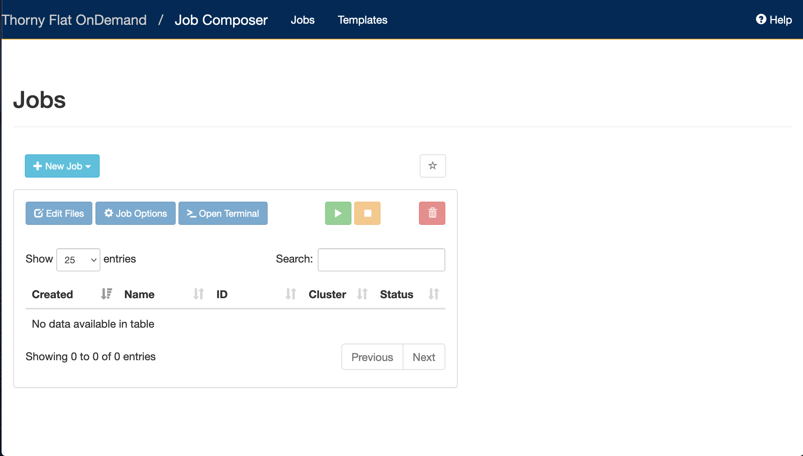

When you are using your own computer and you execute calculations, you are responsible of not overloading the machine with more workload that the machine can actually process efficiently.
If you have just one computer, you monitor the load of the machine and decide if the computer can execute more jobs.
In the case of several machines, you need to log in individually on each machine, submit the jobs and monitor those machines from time to time.

You can easily realize that working this way is pretty inefficient.
What if the job finishes during the night?
What if you have multiple cores but your jobs can only use one?
How to control several machines efficiently?.
These and several other conditions are addressed by using a Resource Manager also known as Batch System or Queue System.


An HPC system such as Thorny Flat or Dolly Sods has tenths nodes and more than 100 users.
How do we decide who gets what and when?
How do we ensure that a task is run with the resources it needs?
This job is handled by a special piece of software called the scheduler.
On an HPC system, the scheduler manages which jobs run where and when.


The scheduler used on our clusters is SLURM.
SLURM is not the only resource manager or scheduler for HPC systems.
There are other software packages that offer similar functionality.
The exact syntax might change, but the concepts remain the same.

A Resource Manager takes care of receiving job submissions and executes those jobs when resources are available providing the most efficient conditions for the jobs.
On the other side, a Job Scheduler is in charge of associating jobs with the appropriated resources and trying to maximize and objective function such as total utilization constrained by priorities and the best balance between the resources requested and resources available.
As SLURM is taking the dual role of Resource Manager and Scheduler we say that SLURM is a Workload Manager a term that better embraces the multiple roles taken by this software package.

>## Changes to the Batch System
>
>In the past our scheduler and resource manager was Torque and Moab.
>All of our clusters use SLURM today. On Thorny Flat we have a compatibility layer such that most Torque/Moab batch scripts will still work. If you are new to WVU's HPC clusters, it makes the most sense to learn the SLURM
>batch commands.  See [Slurm Quick Start Guide](https://slurm.schedmd.com/quickstart.html) for more SLURM information.
{: .callout}

## What is a Batch Script?

The most basic use of the scheduler is to run a command non-interactively.
This is also referred to as batch job submission.
In this case, we need to make a script that incorporates some arguments for SLURM such as resources needed and modules to load.

We will use the ``sleep.sh`` job script as an example.


### Parameters

Let's discuss the example SLURM script, ``sleep.sh``. Go to File Explorer and edit sleep.sh

    $> cd $HOME
    $> mkdir SLEEP
    $> cd SLEEP
    $> nano sleep.sh

Write the following in the file with your text editor:

```
#!/bin/bash

#SBATCH --partition=standby
#SBATCH --job-name=test_job
#SBATCH --time=00:03:00
#SBATCH --nodes=1 --ntasks-per-node=2

echo 'This script is running on:'
hostname
echo 'The date is :'
date
sleep 120
```

Comments in UNIX (denoted by `#`) are typically ignored.
But there are exceptions.
For instance the special `#!` comment at the beginning of scripts
specifies what program should be used to run it (typically `/bin/bash`). This is required in SLURM so don't leave it out!
Schedulers like SLURM also have a special comment used to denote special
scheduler-specific options.
Though these comments differ from scheduler to scheduler,
SLURM's special comment is `#SBATCH`.
Anything following the `#SBATCH` comment is interpreted as an instruction to the scheduler.

In our example, we have set the following parameters:

| Option | Name | Example Setting | Notes|
| --- | --- | --- | --- |
| ``--partition`` | queue | standby | See next section for queue info |
| ``--job-name`` | jobname| test_script | Name of your script (no spaces, alphanumeric only) |
| ``--time`` | total job time| multiple settings| See next segment|
| ``--nodes`` | nodes requested| multiple settings| See next segment|
| ``--ntasks-per-node`` | cores per node | multiple settings| See next segment|

### Resource list
Resource list will contain a number of settings that informs the scheduler what resources to allocate for your job and for how long (walltime).

#### Walltime
Walltime is represented by `--time=00:03:00` in the format HH:MM:SS. This will be how long the job will run before timing out.  If your job exceeds this time the scheduler will terminate the job. It is recommended to find a usual runtime for the job and add some more (say 20%) to it. For example, if a job took approximately 10 hours, the walltime limit could be set to 12 hours, e.g. "--time=12:00:00". By setting the walltime the scheduler can perform job scheduling more efficiently and also reduces occasions where errors can leave the job stalled but still taking up resource for the default much longer walltime limit (for queue walltime defaults run "squeue " command)

>## Walltime test exercise
>
>Resource requests are typically binding.
>If you exceed them, your job will be killed.
>Let's use walltime as an example.
>We will request 30 seconds of walltime,
>and attempt to run a job for two minutes.
>
>```
>#!/bin/bash
>
>#SBATCH --partition=standby
>#SBATCH --job-name=test_job
>#SBATCH --time=00:00:30
>#SBATCH --nodes=1 --ntasks-per-node=2
>
>echo 'This script is running on:'
>hostname
>echo 'The date is :'
>date
>sleep 120
>
>```
>
>Submit the job and wait for it to finish.
>Once it is has finished, check the error log file. In the error file, there will be
>```
>This script is running on:
>This script is running on:
>taicm002.hpc.wvu.edu
>The date is :
>Thu Jul 20 19:25:21 EDT 2023
>slurmstepd: error: *** JOB 453582 ON taicm002 CANCELLED AT 2023-07-20T19:26:33 DUE TO TIME LIMIT ***
>
>```
>
> > ## What happened?
> >
> >Our job was killed for exceeding the amount of resources it requested.
> > Although this appears harsh, this is actually a feature.
> >Strict adherence to resource requests allows the scheduler to find the best possible place
> >for your jobs.
> >Even more importantly,
> >it ensures that another user cannot use more resources than they've been given.
> >If another user messes up and accidentally attempts to use all of the CPUs or memory on a node,
> >SLURM will either restrain their job to the requested resources or kill the job outright.
> >Other jobs on the node will be unaffected.
> >This means that one user cannot mess up the experience of others,
> >the only jobs affected by a mistake in scheduling will be their own.
>
> {: .solution}
{: .challenge }


#### Compute Resources and Parameters
Compute parameters  The argument `--nodes` specifies the number of nodes (or chunks of resource) required; `--ntasks-per-node` indicates the number of CPUs per chunk required.


| nodes |  tasks |  Description|
|---|---|---|
| 2|  16|  32 Processor job, using 2 nodes and 16 processors per node|
| 4|  8|  32 Processor job, using 4 nodes and 8 processors per node|
| 8|  28|  244 Processor job, using 8 nodes and 28 processor per node|
| 1 | 40 | 40 Processor job, using 1 nodes and 40 processors per node|


Each of these parameters have a default setting they will revert to if not set however this means your script may act differently to what you expect.

You can find out more information about these parameters by viewing the manual page of the `sbatch` function. This will also show you what the default settings are.

```
$> man sbatch
```

> ## Setting up email notifications
>
> Jobs on an HPC system might run for days or even weeks.
> We probably have better things to do than constantly check on the status of our job
> with `squeue`.
> Looking at the [online documentation for `sbatch`](https://slurm.schedmd.com/sbatch.html)
> (you can also google "sbatch slurm"),
> can you set up our test job to send you an email when it finishes?
>
> Hint: you will need to use the `--mail-user` and `--mail-type` options.
{: .challenge}

# Running a batch job (two methods)

## Submit Jobs with job composer on OnDemand

OnDemand also has a tool for job creation and submission to the batch system. The same information as above applies since
it still uses the same underlying queue system. In the Job Composer, you can create a new location in your home directory
for a new job, create or transfer a job script and input files, edit everything, and submit your job all from this screen.

We will run this job in the Job Composer by creating a new job from _specified path_.



You'll see the Job Options page, like this:


Fill it in as shown. Path is `~/SLEEP` and then select Save.


To run the job, select green 'play' button.

If job successfully submitted, a green bar will appear on the top of the page.

Also, OnDemand allows you to view the queue for all systems (not just the one you are on in the shell) under Jobs, select
Active Jobs. You can filter by your jobs, your group's jobs, and all jobs.

## Submitting Jobs via command line

To submit this job to the scheduler, we use the `sbatch` command.

```
$> sbatch sleep.sh
Submitted batch job 453594
$>
```
The number that first appears is your Job ID. When the job is completed, you will get two files: an Output and an Error file (even if there is no errors). They will be named {JobName}.o{JobID} and {JobName}.e{JobID} respectively.

And that's all we need to do to submit a job.
To check on our job's status, we use the command `squeue`.

```
$> squeue -u $USER
             JOBID PARTITION     NAME     USER ST       TIME  NODES NODELIST(REASON)
            453594   standby test_job gufranco  R       0:34      1 taicm009

```

{: .output}

We can see all the details of our job, most importantly if it is in the "R" or "RUNNING" state.
Sometimes our jobs might need to wait in a queue ("PD") or have an error.
The best way to check our job's status is with `squeue`. It is easiest to view just your own jobs in the queue with the `squeue -u $USER`. Otherwise, you get the entire queue.


## Partitions (Also known as queues)

There are usually a number of available partitions (Other resource managers call them queues) to use on the HPC clusters.
Each cluster has separate partitions.
The same compute node can be associated to multiple partitions
Your job will be routed to the appropriate compute node based on the list of nodes associated with the partition, the walltime, and the computational resources requested.
To get the list of partitions on the cluster, execute:

	$> sinfo -s
	PARTITION       AVAIL  TIMELIMIT   NODES(A/I/O/T) NODELIST
	standby*           up    4:00:00      94/71/2/167 taicm[001-009],tarcl100,tarcs[100,200-206,300-304],tbdcx001,tbmcs[001-011,100-103],tbpcm200,tbpcs001,tcbcx100,tcdcx100,tcgcx300,tcocm[100-104],tcocs[001-064,100],tcocx[001-003],tcscm300,tjscl100,tjscm001,tmmcm[100-108],tngcm200,tpmcm[001-006],tsacs001,tsdcl[001-002],tsscl[001-002],ttmcm[100-101],tzecl[100-107],tzecs[100-115]
	comm_small_day     up 1-00:00:00        59/5/1/65 tcocs[001-064,100]
	comm_small_week    up 7-00:00:00        59/5/1/65 tcocs[001-064,100]
	comm_med_day       up 1-00:00:00          5/0/0/5 tcocm[100-104]
	comm_med_week      up 7-00:00:00          5/0/0/5 tcocm[100-104]
	comm_xl_week       up 7-00:00:00          3/0/0/3 tcocx[001-003]
	comm_gpu_inter     up    4:00:00         8/1/2/11 tbegq[200-202],tbmgq[001,100],tcogq[001-006]
	comm_gpu_week      up 7-00:00:00          5/0/1/6 tcogq[001-006]
	aei0001            up   infinite          3/5/1/9 taicm[001-009]
	alromero           up   infinite        12/2/0/14 tarcl100,tarcs[100,200-206,300-304]
	be_gpu             up   infinite          1/1/1/3 tbegq[200-202]
	bvpopp             up   infinite          0/1/0/1 tbpcs001
	cedumitrescu       up   infinite          1/0/0/1 tcdcx100
	cfb0001            up   infinite          0/1/0/1 tcbcx100
	cgriffin           up   infinite          1/0/0/1 tcgcx300
	chemdept           up   infinite          0/4/0/4 tbmcs[100-103]
	chemdept-gpu       up   infinite          1/0/0/1 tbmgq100
	cs00048            up   infinite          0/1/0/1 tcscm300
	jaspeir            up   infinite          0/2/0/2 tjscl100,tjscm001
	jbmertz            up   infinite        3/14/0/17 tbmcs[001-011,100-103],tbmgq[001,100]
	mamclaughlin       up   infinite          1/8/0/9 tmmcm[100-108]
	ngarapat           up   infinite          0/1/0/1 tngcm200
	pmm0026            up   infinite          0/6/0/6 tpmcm[001-006]
	sbs0016            up   infinite          0/2/0/2 tsscl[001-002]
	spdifazio          up   infinite          0/2/0/2 tsdcl[001-002]
	tdmusho            up   infinite          1/5/0/6 taicm[001-004],ttmcm[100-101]
	vyakkerman         up   infinite          1/0/0/1 tsacs001
	zbetienne          up   infinite        6/18/0/24 tzecl[100-107],tzecs[100-115]
	zbetienne_large    up   infinite          6/2/0/8 tzecl[100-107]
	zbetienne_small    up   infinite        0/16/0/16 tzecs[100-115]


> ## Submitting resource requests
>
> Submit a job that will use 1 node, 4 processors, and 5 minutes of walltime.
{: .challenge}


## Job environment variables

SLURM sets multiple environment variables at submission time. The following variables are commonly used in command files:


| Variable Name |  Description |
|---|---|
| `$SLURM_JOB_ID` |  Full jobid assigned to this job. Often used to uniquely name output files for this job, for example: srun - np 16 ./a.out >output.${SLURM_JOB_ID}|
| `$SLURM_JOB_NAME`|  Name of the job. This can be set using the --job-name option in the SLURM script (or from the command line). The default job name is the name of the SLURM script.|
| `$SLURM_JOB_NUM_NODES` |  Number of nodes allocated |
| `$SLURM_JOB_PARTITION` |  Queue job was submitted to.|
| `$SLURM_NTASKS` |  The number of processes requested|
| `$SLURM_SUBMIT_DIR`|  The directory from which the batch job was submitted. |
| `$SLURM_ARRAY_TASK_ID` |  Array ID numbers for jobs submitted with the -a flag. |


## Canceling a job


Sometimes we'll make a mistake and need to cancel a job.
This can be done with the `qdel` command.
Let's submit a job and then cancel it using its job number.

```
$> sbatch sleep.sh
Submitted batch job 453599

$> $ squeue -u $USER
             JOBID PARTITION     NAME     USER ST       TIME  NODES NODELIST(REASON)
            453599   standby test_job gufranco  R       0:47      1 tcocs015
```

Now cancel the job with it's job number.
Absence of any job info indicates that the job has been successfully canceled.

```
$> scancel 453599
$> squeue -u $USER
             JOBID PARTITION     NAME     USER ST       TIME  NODES NODELIST(REASON)
```

## Detailed information about jobs

The information provided by the command squeue sometimes is not enough and you would like to gather a more complete picture of the state of a particular job. The command scontrol provides a wealth of information about jobs but also partitions and nodes. Information about a job:

	$ sbatch sleep.sh
	Submitted batch job 453604
	$ scontrol show job 453604
	JobId=453604 JobName=test_job
	   UserId=gufranco(318130) GroupId=its-rc-thorny(1079001) MCS_label=N/A
	   Priority=11588 Nice=0 Account=its-rc-admin QOS=normal
	   JobState=RUNNING Reason=None Dependency=(null)
	   Requeue=0 Restarts=0 BatchFlag=1 Reboot=0 ExitCode=0:0
	   RunTime=00:00:19 TimeLimit=00:04:00 TimeMin=N/A
	   SubmitTime=2023-07-20T20:39:15 EligibleTime=2023-07-20T20:39:15
	   AccrueTime=2023-07-20T20:39:15
	   StartTime=2023-07-20T20:39:15 EndTime=2023-07-20T20:43:15 Deadline=N/A
	   PreemptEligibleTime=2023-07-20T20:39:15 PreemptTime=None
	   SuspendTime=None SecsPreSuspend=0 LastSchedEval=2023-07-20T20:39:15 Scheduler=Main
	   Partition=standby AllocNode:Sid=trcis001:31864
	   ReqNodeList=(null) ExcNodeList=(null)
	   NodeList=taicm007
	   BatchHost=taicm007
	   NumNodes=1 NumCPUs=2 NumTasks=2 CPUs/Task=1 ReqB:S:C:T=0:0:*:*
	   TRES=cpu=2,node=1,billing=2
	   Socks/Node=* NtasksPerN:B:S:C=2:0:*:* CoreSpec=*
	   MinCPUsNode=2 MinMemoryNode=0 MinTmpDiskNode=0
	   Features=(null) DelayBoot=00:00:00
	   OverSubscribe=OK Contiguous=0 Licenses=(null) Network=(null)
	   Command=/gpfs20/users/gufranco/SLEEP/sleep.sh
	   WorkDir=/gpfs20/users/gufranco/SLEEP
	   StdErr=/gpfs20/users/gufranco/SLEEP/slurm-453604.out
	   StdIn=/dev/null
	   StdOut=/gpfs20/users/gufranco/SLEEP/slurm-453604.out
	   Power=

## Interactive jobs

Sometimes, you will need a lot of resources for interactive use.
Perhaps it's the first time running an analysis
or we are attempting to debug something that went wrong with a previous job.

You can also request interactive jobs on OnDemand using the Interactive Apps menu

To submit an interactive job requesting 4 cores on the partition standby and with a walltime of 40 minutes, execute:

	$> srun -p standby -t 40:00 -c 4 --pty bash

Another example includes requesting a GPU compute compute, execute:

	$> srun -p comm_gpu_inter -G 1 -t 2:00:00 -c 8 --pty bash

## Job arrays

Job arrays offer a mechanism for submitting and managing collections of similar jobs quickly and easily; job arrays with many tasks can be submitted from a single submission script.
Job arrays are very useful for testing jobs when one parameter is changed or to execute the same workflow on a set of samples.

For our example, we will create a folder FIBONACCI and a submission script called `fibo.sh`

	$> mkdir FIBONACCI
	$> cd FIBONACCI/
	$> nano fibo.sh

Write the content of the submission script as follows:

	#!/bin/bash

	#SBATCH --partition=standby
	#SBATCH --job-name=test_job
	#SBATCH --time=00:03:30
	#SBATCH --nodes=1 --ntasks-per-node=2
	#SBATCH --array 1-10

	# Static input for N
	N=10

	# First Number of the
	# Fibonacci Series
	a=$SLURM_ARRAY_TASK_ID

	# Second Number of the
	# Fibonacci Series
	b=`expr $SLURM_ARRAY_TASK_ID + 1`

	echo "10 first elements in the Fibonacci Sequence"
	echo ""
	echo "Starting with $a and $b"
	echo ""

	for (( i=0; i<N; i++ ))
	do
	    echo -n "$a "
	    fn=$((a + b))
	    a=$b
	    b=$fn
	done
	# End of for loop
	echo ""
	sleep 60

On job arrays the array index values are specified using the ``--array`` or ``-a`` option of the sbatch command.
All the jobs in the job array will have the same variables except for the environment variable SLURM_ARRAY_TASK_ID
that is set to its array index value.
This variable can be used to redirect the workflow to a different folder or execute the simulation with different parameters.

Submit the job array:

	$> sbatch fibo.sh
	Submitted batch job 453632
	$> squeue -u $USER
             JOBID PARTITION     NAME     USER ST       TIME  NODES NODELIST(REASON)
          453632_1   standby test_job gufranco  R       0:03      1 taicm007
          453632_2   standby test_job gufranco  R       0:03      1 taicm007
          453632_3   standby test_job gufranco  R       0:03      1 taicm007
          453632_4   standby test_job gufranco  R       0:03      1 taicm007
          453632_5   standby test_job gufranco  R       0:03      1 taicm007
          453632_6   standby test_job gufranco  R       0:03      1 taicm007
          453632_7   standby test_job gufranco  R       0:03      1 taicm007
          453632_8   standby test_job gufranco  R       0:03      1 taicm007
          453632_9   standby test_job gufranco  R       0:03      1 taicm007
         453632_10   standby test_job gufranco  R       0:03      1 taicm007

The job submission will create 10 jobs
When the jobs finishes their output will be in files `slurm-XXX`. For example:

	$> cat slurm-453632_7.out
	10 first elements in the Fibonacci Sequence

	Starting with 7 and 8

	7 8 15 23 38 61 99 160 259 419



